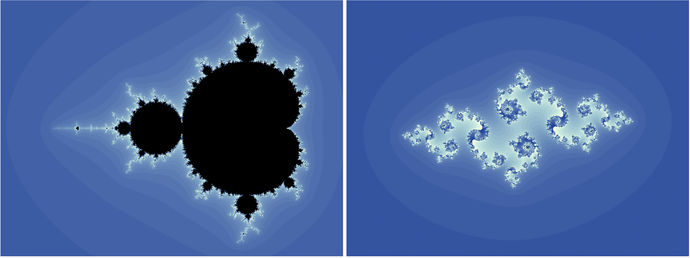

# JavaScript Mandelbrot and Julia Set Explorer

Using some JavaScript wizardry it's possible to have an interactive Mandelbrot and Julia set explorer, with no other code.  Clicking the mouse at any point in the Mandelbrot set will draw the corresponding Julia set.  Setting the Auto-draw Julia Set option to On and moving the mouse over the Mandelbrot set will provide an interactive Julia-set journey.

There is a Zoom function, enabled by hitting the Z key over the Mset canvas.  To zoom in click the left mouse button, to zoom out, click the right.  When you're happy with the zoom window hit enter to redraw.

Take a look at the Mandelbrot and Julia set generator using HTML 5 canvas element in action by visiting our GitHub Page at http://mikebharris.github.io/canvas_mandelbrot_explorer/

There's also an [archive of old Fractal work I did with Dan Grace back in the Eighties](https://mbharris.co.uk/fe3/).  This program, called the Fractal Engine, was a Mandlebrot and Julia set explorer written in GFA Basic for the Atari ST.
